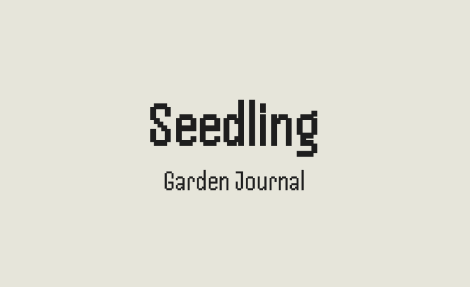
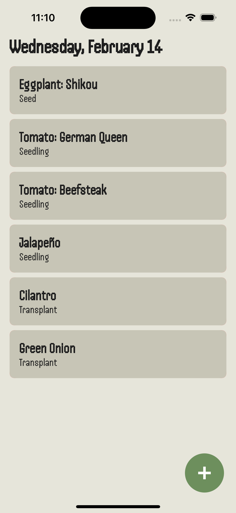
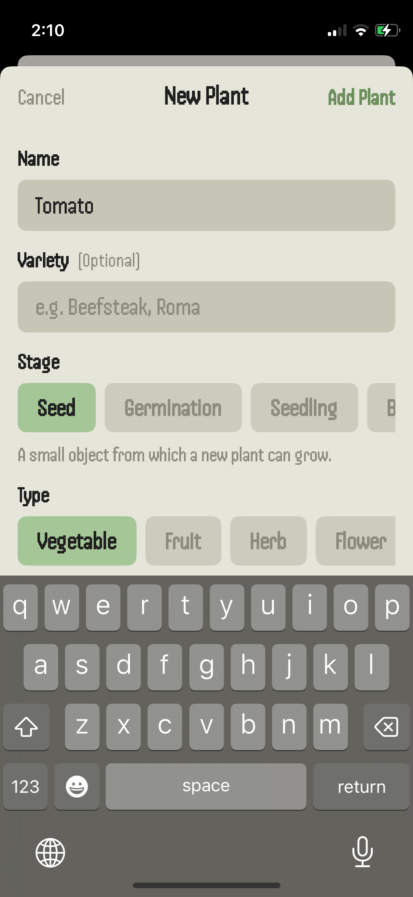

<?xml version="1.0" encoding="UTF-8" standalone="no"?>
<document type="com.apple.InterfaceBuilder3.CocoaTouch.XIB" version="3.0" toolsVersion="13142" targetRuntime="iOS.CocoaTouch" propertyAccessControl="none" useAutolayout="YES" useTraitCollections="YES" useSafeAreas="YES" colorMatched="YES">
    <dependencies>
        <plugIn identifier="com.apple.InterfaceBuilder.IBCocoaTouchPlugin" version="12042"/>
    </dependencies>
    <objects>
        <placeholder placeholderIdentifier="IBFilesOwner" id="-1" userLabel="File's Owner"/>
        <placeholder placeholderIdentifier="IBFirstResponder" id="-2" customClass="UIResponder"/>
    </objects>
</document>

# Seedling

## Summary
Seedling is a journaling platform that enables users to capture significant moments of their gardening journey. Many gardening products revolve around the workflow aspects of gardening such as tracking specific plant needs with reminders to complete certain tasks. Seedling was created to capture the history of your garden in story form through a timeline of thoughts, photos, and events.

## About the developer
Seedling was created by [Laurie Cai](https://www.linkedin.com/in/lauriecai), a product designer based in California transitioning into software engineering. 

## Technologies
* SwiftUI
* CoreData
* MVVM architecture

## Features

