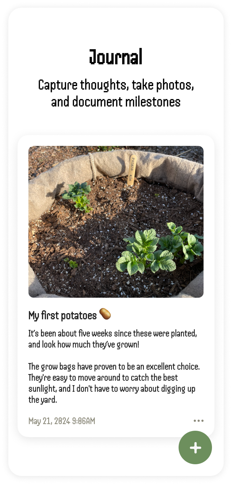

<?xml version="1.0" encoding="UTF-8" standalone="no"?>
<document type="com.apple.InterfaceBuilder3.CocoaTouch.XIB" version="3.0" toolsVersion="13142" targetRuntime="iOS.CocoaTouch" propertyAccessControl="none" useAutolayout="YES" useTraitCollections="YES" useSafeAreas="YES" colorMatched="YES">
    <dependencies>
        <plugIn identifier="com.apple.InterfaceBuilder.IBCocoaTouchPlugin" version="12042"/>
    </dependencies>
    <objects>
        <placeholder placeholderIdentifier="IBFilesOwner" id="-1" userLabel="File's Owner"/>
        <placeholder placeholderIdentifier="IBFirstResponder" id="-2" customClass="UIResponder"/>
    </objects>
</document>

# Seedling

## Summary
Seedling is a simple journaling app to track your plant progress. Write about growth patterns and track important milestones, keep track of plant care requirements from sunlight preferences to soil types, and manage your garden tasks through categorized to-do lists.

## About the developer
Seedling was created by [Laurie Cai](https://www.linkedin.com/in/lauriecai), a product designer based in California. 

## Technologies
* SwiftUI
* CoreData
* MVVM architecture

## Features

